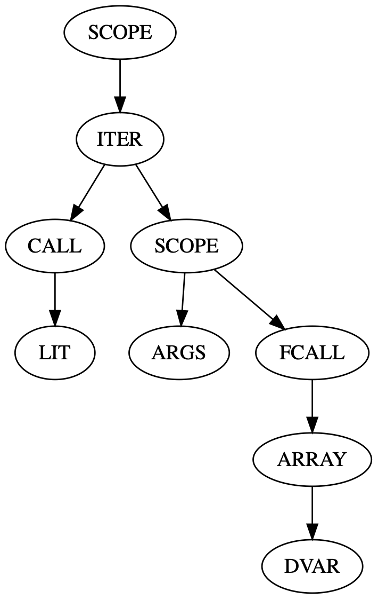

# AST2Dot

## Installation

require RUBY_VERSION >= 2.6.0

```ruby
gem 'ast2dot'
```

## Usage

```ruby
10.times do |n|
  puts n
end
```

```
ast2dot example.rb | dot -Tpng -o example.png | open example.png 
```



## License

The gem is available as open source under the terms of the [MIT License](https://opensource.org/licenses/MIT).

## Code of Conduct

Everyone interacting in the Ast2dot project’s codebases, issue trackers, chat rooms and mailing lists is expected to follow the [code of conduct](https://github.com/[USERNAME]/ast2dot/blob/master/CODE_OF_CONDUCT.md).
